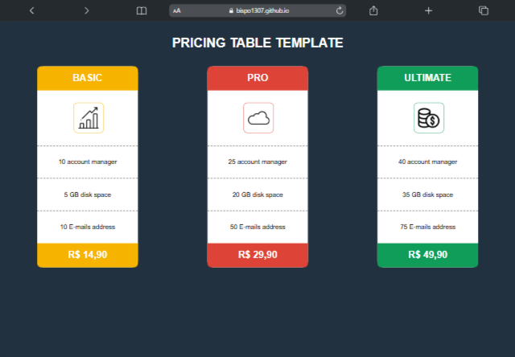
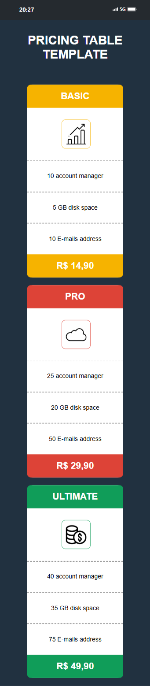

# 💸 Pricing Table Template

Este é um projeto simples e responsivo de **Tabela de Preços**, desenvolvido com foco em praticar **Flexbox** e **responsividade com HTML e CSS**.

  

## 🧾 Descrição

O projeto apresenta três planos (Basic, Pro e Ultimate), cada um com uma quantidade diferente de recursos. A interface se adapta a diferentes tamanhos de tela, garantindo uma boa visualização tanto em **dispositivos móveis** quanto em **desktops**.

## 🚀 Tecnologias Utilizadas

- HTML5

- CSS3

- Flexbox

## 🎯 Objetivo

Praticar:
- Estruturação de layouts com Flexbox

- Técnicas de responsividade em CSS

- Design simples e funcional

## 📱 Demonstração

- 💻 Versão desktop:

  

- 📱 Versão mobile:

  

## 🌐 Acesse o projeto

- 🔗 [Site Online](https://bispo1307.github.io/Pricing-Table/)

## 📁 Repositório

- [Repositório no GitHub](https://github.com/Bispo1307/Pricing-Table)

---

